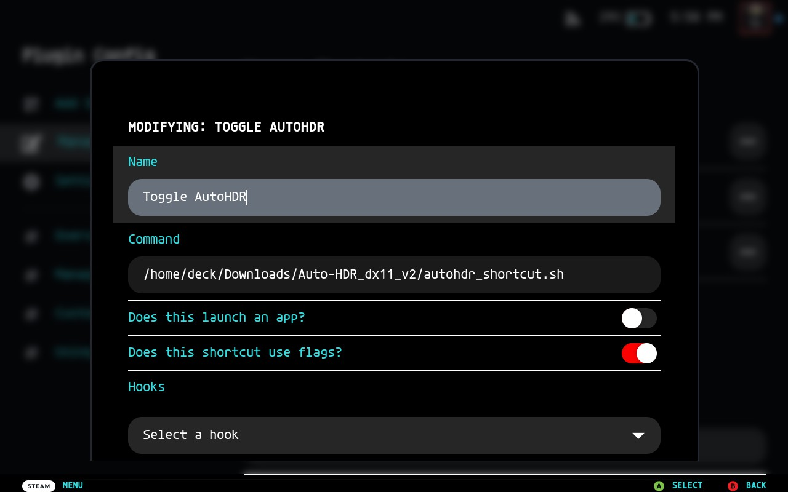

# Steam Deck Auto HDR Toggle

This guide provides instructions for setting up an easy way to toggle Auto HDR on a per-game level for the Steam Deck OLED using Decky Loader and the Bash Shortcuts plugin. The included script will take the appid of the current game from Bash Shortcuts and automatically copy/link the required files into the game directory.

## Prerequisites

1. **Decky Loader** - Install from [Decky Loader](https://decky.xyz/).
2. **Bash Shortcuts Plugin** - Install from [Bash Shortcuts Plugin for Decky](https://github.com/SDH-Stewardship/bash-shortcuts).

## Instructions

### Temporary Fix for Bash Shortcuts Plugin

> **NOTE: If you have version 2.0.4 or later of the Bash Shortcuts plugin, you can ignore this step.**

Due to a current issue in the Bash Shortcuts plugin that prevents flags from being passed correctly to scripts, you need to perform the following steps:

1. Open the file `/home/deck/homebrew/plugins/bash-shortcuts/py_backend/instanceManager.py`.
2. Change line 28 from:

    ```python
    self.shortcutProcess = subprocess.Popen(command, shell=True)
    ```

    to:

    ```python
    self.shortcutProcess = subprocess.Popen(' '.join(command), shell=True)
    ```

3. Restart the Deck to apply changes.

### Setting Up Auto HDR

1. Clone or download and unzip this repo to the `Downloads` directory on your Deck. (or grab a **VERIFIED** build from [releases](https://github.com/JediRhymeTrix/deck-toggle-autohdr/releases))
2. Boot into game mode and navigate to the Bash Shortcuts plugin.
3. Create two new shortcuts for 32-bit and 64-bit games respectively:
   - Navigate to plugin config > add shortcut.
   - Name the shortcuts appropriately (e.g., Toggle AutoHDR 32-bit, Toggle AutoHDR 64-bit).
   - Set the command for 32-bit games to:

        ```bash
        sh +x /home/deck/Downloads/deck-toggle-autohdr/autohdr_shortcut_32bit.sh
        ```

   - Set the command for 64-bit games to:

        ```bash
        sh +x /home/deck/Downloads/deck-toggle-autohdr/autohdr_shortcut_64bit.sh
        ```

   - Configure the toggles as shown in the screenshot below:

     

   - Save the shortcuts.

4. To enable Auto HDR for a game:
   - Determine if the game is 32-bit or 64-bit.
   - Go to the game view page for any installed Steam game or launch a game.
   - Open the Bash Shortcuts plugin in the Quick Access Menu (QAM) and run the appropriate shortcut based on the game's architecture.
   - Once the shortcut has run, it should have copied the required files to the game's directory.
   - Either run the game if you were on the game view page, or exit and re-launch if the game was already running. Auto HDR should now be enabled.

5. To disable Auto HDR, repeat Step 4 with the appropriate shortcut. The same shortcut will remove Auto HDR from the game.

### Updating ReShade

To update ReShade or the Auto HDR plugin, go to the [releases](https://github.com/JediRhymeTrix/deck-toggle-autohdr/releases) page and download the latest version or select a specific release with the version of ReShade you want. Note that releases marked with **UNTESTED** were auto-generated with the newest version of ReShade and aren't guaranteed to be compatible with this Auto-HDR plugin.

To update, add the new files to the correct directories and trigger the shortcut twice to update the files in the game directories.

## Limitations

The limitations are the same as those for the Reshade Auto HDR plugin. For more details, refer to this [Twitter post](https://twitter.com/JavaidUsama/status/1763443358318428400).

## Credits

- **Reshade and Auto-HDR Plugin Developers** - For building the functionality.
- **@JavaidUsama** - For sharing the the AutoHDR files on [Twitter](https://twitter.com/JavaidUsama/status/1763443358318428400).
- **[u/ManSore](https://www.reddit.com/r/SteamDeck/comments/1b4dl1k/comment/kupo8b3/)** - For providing the 32-bit version of the AutoHDR files.
- **[Tormak](https://github.com/Tormak9970)** - The original author the Bash Shortcuts plugin.
- **[SDH-Stewardship](https://github.com/SDH-Stewardship)**: The team behind the Decky plugin stewardship program for supporting the Bash Shortcuts plugin.
- **Decky Loader Team** - For making plugin integration possible on the Steam Deck.

## Note

This guide and the scripts are currently in a very rough proof of concept stage. Plans for refinement are in place, especially once the issue with the Bash Shortcuts plugin is resolved.
